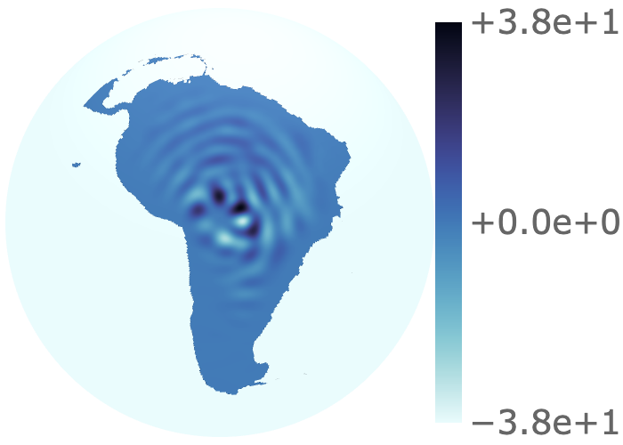
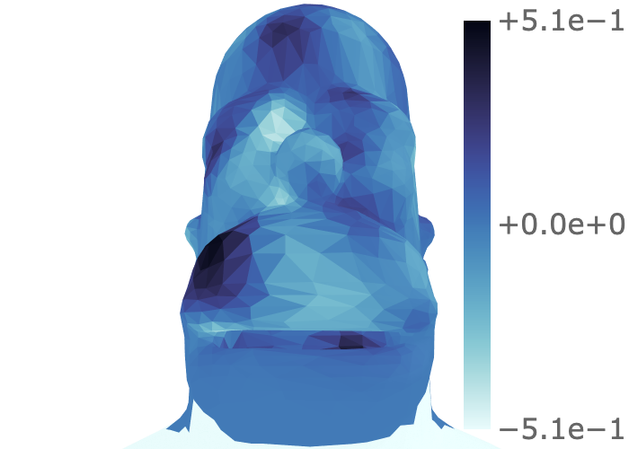

# SLEPLET

[](https://pypi.org/project/sleplet)
[](https://www.python.org)
[](https://astro-informatics.github.io/sleplet)
[](https://doi.org/10.5281/zenodo.7268074)
[](https://github.com/astro-informatics/sleplet/actions/workflows/test.yml)
[](https://github.com/pre-commit/pre-commit)

`SLEPLET` is a Python package for the construction of Slepian wavelets in the
spherical and manifold (via meshes) settings. The API of `SLEPLET` has been
designed in an object-orientated manner and is easily extendible. Upon
installation, `SLEPLET` comes with two command line interfaces - `sphere` and
`mesh` - which allows one to easily generate plots on the sphere and a set of
meshes using `plotly`.

## Installation

The recommended way to install `SLEPLET` is via
[pip](https://pypi.org/project/pip/)

```sh
pip install sleplet
```

To install the latest development version of `SLEPLET` clone this repository
and run

```sh
pip install -e .
```

This will install two scripts `sphere` and `mesh` which can be used to generate
the figures in
[the associated papers](https://astro-informatics.github.io/sleplet/#paper-figures).

### Supported Platforms

`SLEPLET` has been tested with
[](https://www.python.org).
Windows is not currently supported as `SLEPLET` relies on
[pyssht](https://pypi.org/project/pyssht) and
[pys2let](https://pypi.org/project/pys2let) which do not work on Windows.
These can hopefully be replaced with
[s2fft](https://github.com/astro-informatics/s2fft/) and
[s2wav](https://github.com/astro-informatics/s2wav) in the future when they
are available on [PyPI](https://pypi.org/).

## Example Usage

`SLEPLET` may be interacted with via the API or the CLIs.

### API Usage

The following demonstrates the first wavelet (ignoring the scaling function) of
the South America region on the sphere.

```python
import sleplet

region = sleplet.slepian.Region(mask_name="south_america")
f = sleplet.functions.SlepianWavelets(128, region=region, B=3, j_min=2, j=0)
f_sphere = sleplet.slepian_methods.slepian_inverse(f.coefficients, f.L, f.slepian)
sleplet.plotting.PlotSphere(
    f_sphere,
    f.L,
    "wavelet_j_2",
    normalise=False,
    region=f.region,
).execute()
```



### CLI Usage

The demonstrates the first wavelet (ignoring the scaling function) of the head
region of a Homer Simpson mesh for a per-vertex normals field.

```mesh
mesh homer -e 3 2 0 -m slepian_wavelet_coefficients -u -z
```



## Documentation

See here for the [documentation](https://astro-informatics.github.io/sleplet).
This includes demonstrations of the figures from the associated papers along
with the API documentation.

## Community Guidelines

We'd love any contributions you may have, please see the
[contributing guidelines](./CONTRIBUTING.md).
